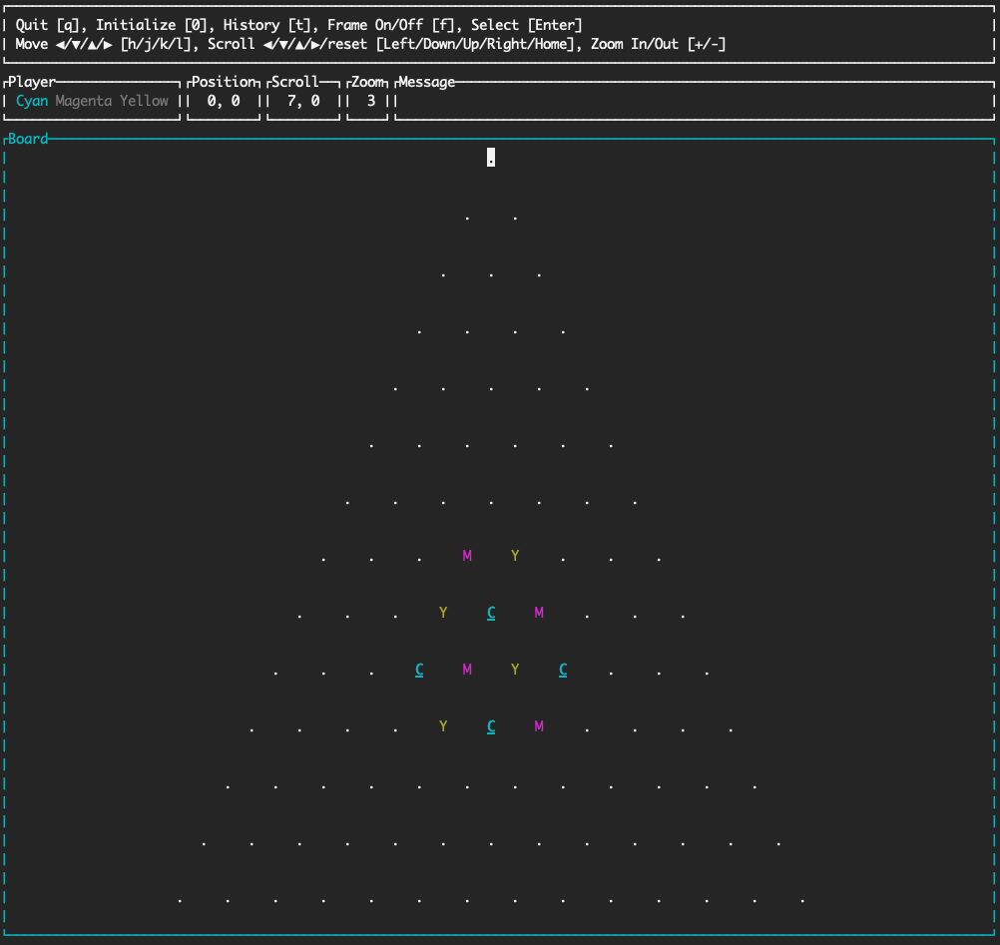

# Triversi

Triversi is a Reversi-like game played by 3 players.



## Installation

Compilation requires the `cargo` command, so if you do not have it,
refer to [this page](https://www.rust-lang.org/ja/tools/install) and install it.

In order to install Triversi, execute the following commands
(refer to [this site](https://doc.rust-lang.org/cargo/commands/cargo-install.html)).

```sh
cd triversi
cargo install --path .
```

If you want to use the alternate key bindings, excute the following commands.

```sh
cd triversi
cargo install --path . --features alternative_key_binding
```

## Usage

```text
Usage: triversi [OPTIONS]

Options:
  -r, --range <RANGE>                Number of positions in one edge (>= 5 & = 0,2 (mod3)) [default: 14]
  -d, --distance <DISTANCE>          Distance between positions (>= 2, <= 10) [default: 3]
  -p, --player-marks <PLAYER_MARKS>  Marks of each player (ascii characters, delimiters are ','),  [default: 1,2,3]
  -h, --help                         Print help
  -V, --version                      Print version

Repository: https://github.com/yu1guana/triversi
```

## Key Bindings

Two key bindings are supported.
If you want to change key bindings, edit the source code ([src/app/key\_binding.rs](src/app/key_binding.rs)).

### Default

```
q: Quit
0: Initialize
Enter: Select
k: Move up
j: Move down
h: Move left
l: Move right
Up: Scroll up
Down: Scroll down
Left: Scroll left
Right: Scroll right
Home: Scroll reset
+: Zoom in
-: Zoom out
f: Frame visibility
```

### Alternative

The below key bindings are set when you select the `alternative_key_binding` feature.

```
q: Quit
0: Initialize
Enter: Select
i: Move up
k: Move down
j: Move left
l: Move right
Up: Scroll up
Down: Scroll down
Left: Scroll left
Right: Scroll right
Home: Scroll reset
+: Zoom in
-: Zoom out
f: Frame visibility
```

## To-Do list

See [.todos.toml](.todos.toml).
Using [git-todos](https://github.com/yu1guana/git-todos), you can read a To-Do list confortably.

## License
Copyright (c) 2023 Yuichi Ishida  
Released under the MIT license  
[https://opensource.org/licenses/mit-license.php](https://opensource.org/licenses/mit-license.php)
